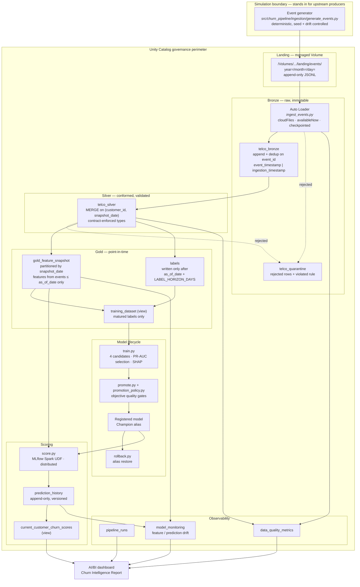
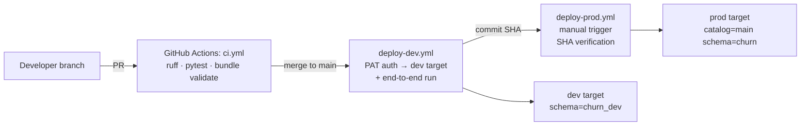

# Architecture

A batch data platform on Databricks that ingests simulated customer events, refines them through a medallion architecture into point-in-time feature snapshots, and serves a governed churn model on top. Everything is deployed as a Databricks Asset Bundle and governed by Unity Catalog.

## System overview

## Implementation status

| Edge / component | Status | Where |
|---|---|---|
| Event generator → landing Volume | Built | `src/churn_pipeline/ingestion/generate_events.py` |
| Landing → Auto Loader → Bronze | Built | `src/churn_pipeline/ingestion/ingest_events.py` |
| CSV → Bronze (seed load, idempotent) | Built | `src/churn_pipeline/ingestion/ingest.py` |
| Bronze dedup on `event_id` | Built | `src/churn_pipeline/ingestion/ingest_events.py` |
| Versioned data contract | Built | `src/churn_pipeline/contracts.py`, `docs/data-contract.md` |
| Quarantine tables and routing | Built | `src/churn_pipeline/transformation/quality.py` |
| Bronze → Silver (MERGE) | Built | `src/churn_pipeline/transformation/transform.py` |
| Silver → Gold point-in-time snapshots | Built | `src/churn_pipeline/transformation/build_features.py` |
| Delayed labels + `training_dataset` | Built | `src/churn_pipeline/transformation/generate_labels.py` |
| Training, 4 candidates, SHAP | Built | `src/churn_pipeline/modeling/train.py` |
| Quality-gated promotion | Built | `src/churn_pipeline/modeling/promote.py`, `promotion_policy.py` |
| Alias rollback | Built | `src/churn_pipeline/modeling/rollback.py` |
| Distributed batch scoring | Built | `src/churn_pipeline/modeling/score.py`, `inference.py` |
| Immutable prediction history + view | Built | `src/churn_pipeline/modeling/score.py` |
| Historical backfill (features + labels) | Built | `churn_backfill_features` job, parameterized by `as_of_date` |
| `data_quality_metrics` | Built | `src/churn_pipeline/transformation/quality.py` |
| `pipeline_runs` | Built | `src/churn_pipeline/ops/run_logger.py` |
| Drift monitoring (PSI + KS) | Built | `src/churn_pipeline/monitoring/monitor.py`, `drift.py` |
| Dashboard | Built | `dashboards/` |

## Layer contracts

**Landing.** Append-only JSONL in a Unity Catalog managed Volume, partitioned by event date. The generator never overwrites: an identical rerun is a no-op, a conflicting rewrite fails. This makes the landing zone a durable, replayable source of truth rather than a staging scratch area.

**Bronze.** Raw events, one row per source record, no business logic. Two timestamps are kept distinct and never conflated:

- `event_timestamp` — when the event happened, supplied by the producer. Drives all feature windows.
- `ingestion_timestamp` — when we wrote it. Drives operational reasoning and late-arrival detection.

Idempotency comes from the deterministic `event_id` (SHA-256 over the event's identifying fields). Re-ingesting a file cannot create duplicates.

**Silver.** Conformed types, enforced data contract, deduplicated, merged rather than overwritten. Rows failing a quarantine-severity rule are routed to `telco_quarantine` with the rule that rejected them; the batch continues. Only a fail-severity violation (for example, zero rows ingested) aborts a run.

**Gold.** Feature snapshots computed as of a date, using strictly `event_timestamp <= as_of_date`. This is the leakage boundary and it is enforced by test, not by convention. Labels for a snapshot are withheld until the prediction horizon has elapsed, so a training set can never contain an outcome that had not yet occurred at feature time.

## Design decisions

**Batch, not streaming.** Auto Loader with an `availableNow` trigger gives incremental, checkpointed, exactly-once file ingestion with batch operational semantics. Churn scores drive a retention campaign that runs daily; sub-second latency buys nothing and costs a continuously running cluster. Streaming becomes the right answer when a downstream consumer acts on individual events in seconds.

**Directory listing over file notification.** At roughly 7,000 customers and one file per day, listing cost is negligible. File notification mode is the correct choice above roughly ten thousand files per batch, and the switch is a configuration change, not a rewrite.

**Rescue mode for schema evolution.** Unexpected new fields land in `_rescued_data` and raise a warning rather than failing the run. Additive upstream changes should not page anyone at 3am; breaking changes should fail loudly and immediately.

**Quarantine over fail-fast.** A single malformed record should not cost a day of scores for every other customer. Rejected rows are preserved with their rejection reason so the failure is diagnosable and replayable after a fix, rather than discarded.

**Serverless compute.** No cluster tuning is a portfolio project's friend, and the bundle stays reproducible on Databricks Free Edition. Bronze and Silver run on an untouched base environment; only the ML tasks install extra libraries, so compiled ML wheels cannot break Spark Connect initialization in the ETL path.

**Distributed inference.** Scoring uses an MLflow Spark UDF. Collecting to the driver with `toPandas()` works at 7K rows and falls over at 10M; the pattern that survives growth is the one worth demonstrating.

## Deployment topology

Both stages authenticate with a Databricks personal access token stored in GitHub secrets, compatible with Databricks Free Edition. Production accepts only a commit SHA that has already deployed successfully to dev. See [deployment.md](deployment.md).

## Failure and recovery

| Failure | Behavior | Recovery |
|---|---|---|
| Malformed records in a batch | Rows quarantined with reason, batch completes | Fix producer, replay the date |
| New field from upstream | Captured in `_rescued_data`, warning emitted | Bump contract version, add mapping |
| Required field removed | Run fails at the contract check | Producer fix or contract version bump |
| Ingestion job crashes mid-run | Auto Loader checkpoint is not advanced | Rerun; already-committed files are skipped |
| Bad day of data discovered later | — | `src/churn_pipeline/ops/backfill.py <start> <end>` re-runs the same code path |
| Candidate model fails quality gates | Promotion rejected, Champion unchanged, decision logged | None needed — this is the gate working |
| Bad model promoted | Prediction history records which version produced each score | `churn_model_rollback --target-version N` |
| Late event arrives | Affected snapshots recomputed within the lateness window | Beyond the window, requires explicit backfill |

## Related documents

- [Data contract](data-contract.md) — event schema, versioning, evolution policy
- [Promotion policy](promotion-policy.md) — the quality gates and their reasoning
- [Rollback](rollback.md) — alias restore procedure and its limits
- [Runbook](runbook.md) — per-job failure modes and first response
- [Event generation](event-generation.md) — simulation contract and drift behavior
- [Deployment](deployment.md) — PAT authentication and CI/CD setup
